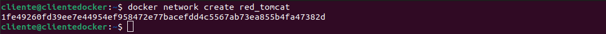
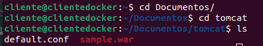
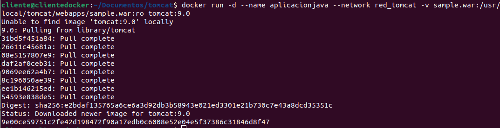
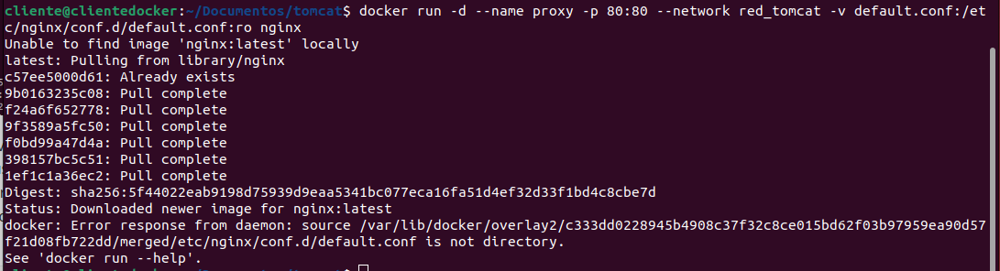

# Ejemplo 4: Despliegue de Tomcat + nginx

> Javier González Díaz

## Desplegando Tomcat

Antes de hacer el despliegue del primer contenedor, vamos a crear una red bridge para conectar los contenedores:

```bash
$ docker network create red_tomcat
```



A continuación vamos a crear un contenedor a partir de la imagen tomcat . En la documentación
podemos ver que el directorio /usr/local/tomcat/webapps/ es donde tenemos que poner el
fichero de despliegue war (vamos a usar bind mount para montar el fichero war en el directorio).
No vamos a mapear puerto porque no vamos a acceder a este contenedor desde el exterior.

```bash
$ cd tomcat
$ ls
```



Y creamos el contenedor conectada a nuestra nueva red:

```bash
$ docker run -d --name aplicacionjava \
--network red_tomcat \
-v
/home/vagrant/tomcat/sample.war:/usr/local/tomcat/webapps/sample.war:ro \
tomcat:9.0
```



Como vemos para realizar el proxy inverso usamos la directiva proxy_pass indicando la dirección
que nos ofrece tomcat, en este caso usamos el nombre del contenedor anterior
( aplicacionjava ) que será resuelto por el servidor DNS interno, usando el puerto estándar de
tomcat el 8080 y el directorio sample donde se ha desplegado la aplicación. Para la creación del
contenedor de nginx:

```bash
 docker run -d --name proxy -p 80:80 --network red_tomcat -v default.conf:/etc/nginx/conf.d/default.conf:ro nginx
```


