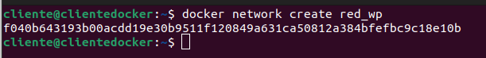
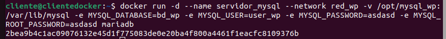
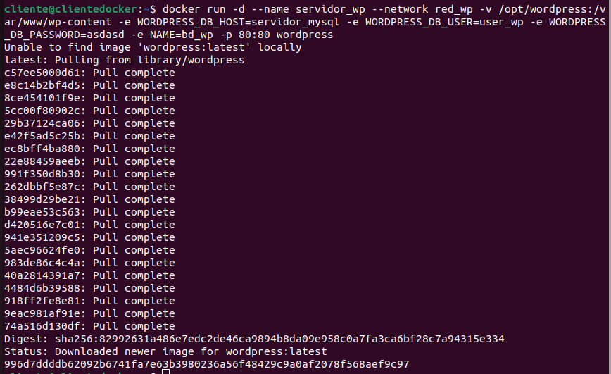
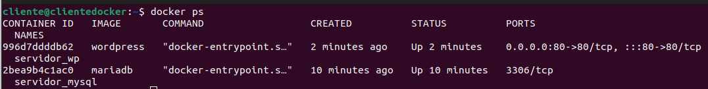
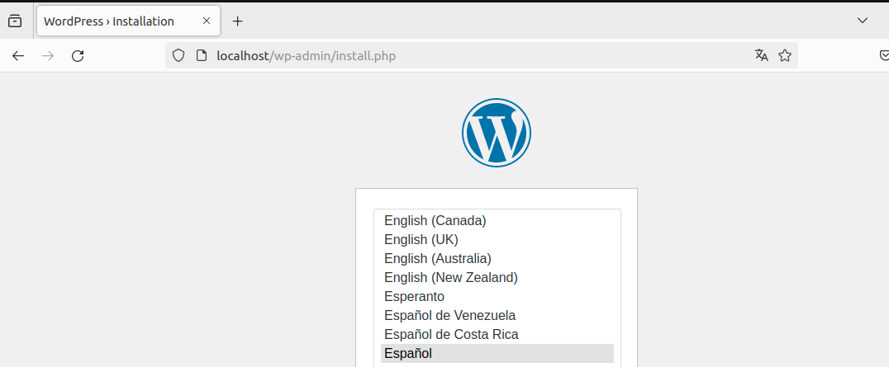

# Ejemplo 3: Despliegue de Wordpress + mariadb

Para la instalacion de WordPress necesitamos dos contenedores: la base de datos y el servidor web con la aplicación. Los dos contenedores tienen que estar en la misma red y deben tener acceso por nombres ya que de principio no sabemos que ip va acoger cada contenedor. Por lo tanto vamos a crear los contenedores en la misma red:

```bash
$ docker network create red_wp
```



Siguiendo la documentación de la imagen mariadb y la imagen wordpress podemos ejecutar los siguientes comandos para crear los dos contenedores:

```bash
$ docker run -d --name servidor_mysql --network red_wp -v /opt/mysql_wp:/var/lib/mysql -e MYSQL_DATABASE=bd_wp -e MYSQL_USER=user_wp -e MYSQL_PASSWORD=asdasd -e MYSQL_ROOT_PASSWORD=asdasd mariadb
```



```bash
docker run -d --name servidor_wp --network red_wp -v /opt/wordpress:/var/www/wp-content -e WORDPRESS_DB_HOST=servidor_mysql -e WORDPRESS_DB_USER=user_wp -e WORDPRESS_DB_PASSWORD=asdasd -e WORDPRESS_DB_NAME=bd_wp -p 80:80 wordpress
```



```bash
$ docker ps
```



Funcionamiento:

